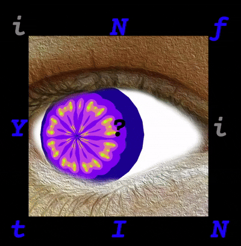
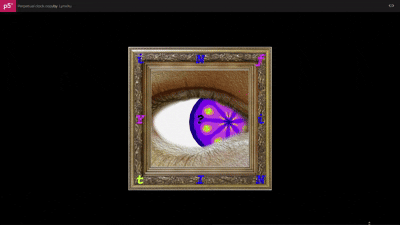
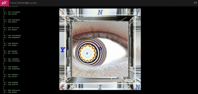

My 2025 s1 assignment in RMIT.

# 🌌 Interactive Eye

An interactive visual experiment exploring p5js+WebGL2, fractal(Mandelbrot set & Julia set), machine learning.

## 🎨 Description
This sketch simulates a responsive eye that follows the audience's face and reacts to movement through computer camera.
It uses **p5.js + WebGL2** and integrates **evolution of fractal** and **color blending** techniques inspired by classical fractals aesthetics.

## 🧠 Concept
Inspired by the idea of “seeing through the defect,” this work is part of our studio work, which explores how small distortions can create a sense of life and awareness. This programming part act as the main projection of the whole project. To see the full project design research compendium, please see the .

## 🛠️ Technologies
- p5.js
- WebGL2
- ml5.js
- classical fractal (Julia set)

## 📸 Preview

## 🧩 Live Demo
👉 [Try it on p5js](https://editor.p5js.org/LynxXu/full/XmzyDFsN0)
↑ The eye will track your face through the input of your camera.

👉 [Progress1: First try on ml5+fractal](https://editor.p5js.org/LynxXu/full/PvKHHqEVe)
↑ Move your mouse to interact

👉 [Progress2: First try on WebGL2+fractal](https://editor.p5js.org/LynxXu/full/XmzyDFsN0)
↑ Show your two hands to the camera and make some poses

## 👩‍💻 Author
**Yixing Lynx Xu**  
Master of Design, Innovation & Technology @ RMIT University  
[Portfolio Link](https://your-notion-or-portfolio-link.com)
